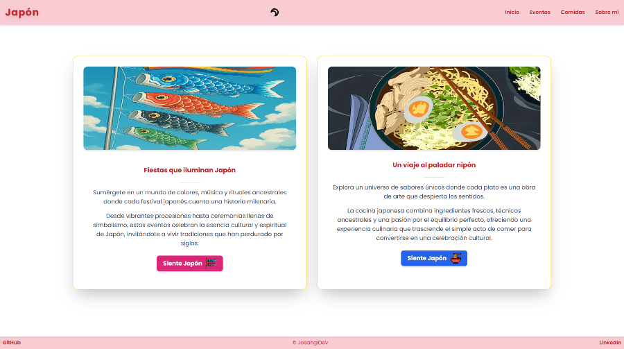
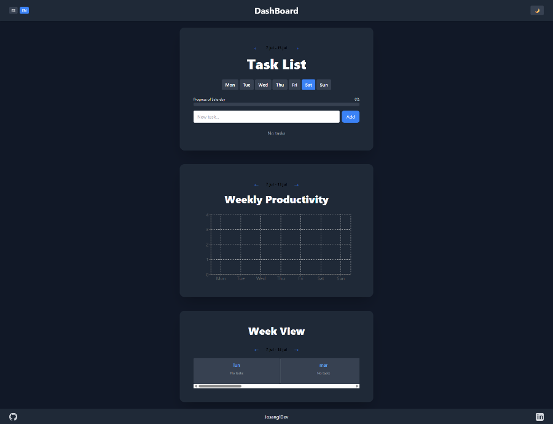

# ¡Hola 👋! Soy Jose Antonio García López

Soy desarrollador frontend y disfruto construir cosas desde cero, ver cómo una idea toma forma en la pantalla.  
Me apasiona el mundo web, trabajar con tecnologías modernas y seguir creciendo día a día en este camino que tanto me entusiasma.  
Me considero una persona comunicativa, que trabaja bien en equipo y afronta los problemas como oportunidades para aprender y mejorar constantemente.

## 

---

## 🧠 Skills

---

## 🚀 Proyectos

### Japón - Festividades y Gastronomía

Descubre la riqueza cultural de Japón a través de sus festivales y su gastronomía.  
Este proyecto es una web estática, visualmente atractiva y responsive, desarrollada con **Vite**, **TailwindCSS**, **JavaScript** y desplegada en **Vercel**.

🔗 [Ver sitio en producción](https://japon-web.vercel.app/) 

📂 [Ver repositorio en GitHub](https://github.com/josangldev/japon-web)

  

---

### Pokémon Kanto - Pokédex y Trivial  
Una web interactiva donde podrás explorar a los 151 Pokémon de Kanto, acceder a sus estadísticas y jugar a un **trivial** para poner a prueba tus conocimientos.  
Desarrollado con **HTML**, **SCSS** y **JavaScript** puros.

🔗 [Ver sitio en producción](https://pokemon-kanto.vercel.app/)

📂 [Ver repositorio en GitHub](https://github.com/josangldev/pokemon-kanto)

  

---

## 🎓 Formación y Certificaciones

- 🏅 **Certificaciones por Conquer Blocks**:
  - Pseudocódigo
  - Terminal
  - Python
  - Principios SOLID
  - Git y GitHub
  - HTML, CSS, JavaScript, TypeScript y React

- 🌍 **Inglés B1** certificado por [FreeCodeCamp](https://www.freecodecamp.org/)

> 📚 Aprendizaje continuo a través de múltiples fuentes especializadas del sector, incluyendo canales de YouTube de reconocidos referentes como Midudev y MoureDev, así como desafíos técnicos como el 30 Days of JavaScript Challenge en GitHub.  
Complemento esta formación con el contenido de FreeCodeCamp, estudio guiado por
documentación oficial, y el uso de herramientas de inteligencia artificial como CursorAI y similares,
aplicadas tanto como soporte de aprendizaje, como para la optimización de procesos y productividad
personal.

---

## 📫 Contacto

  

---

## 🎯 Actualmente

> 🔍 Actualmente en búsqueda de oportunidades como **Desarrollador Frontend Junior**.

---

> 🧩 *"No le tengas miedo a los bugs, son tus mejores maestros."*

  

